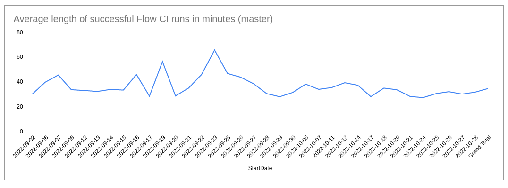
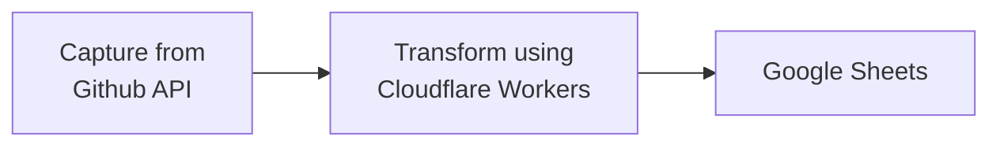
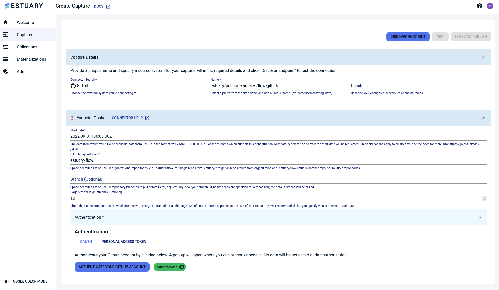
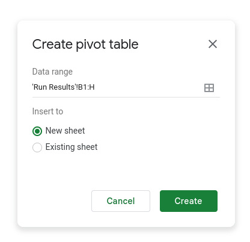
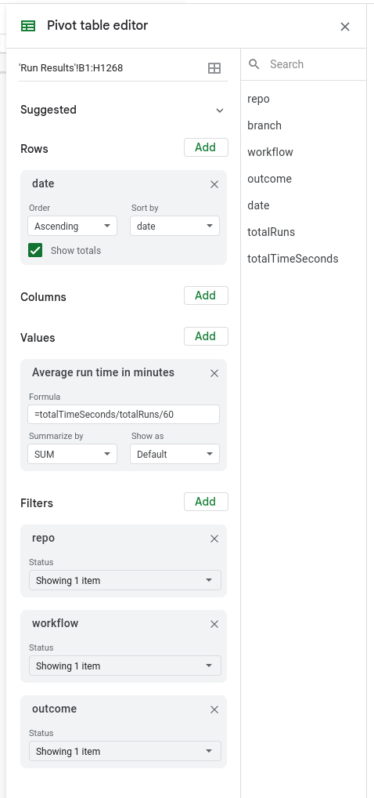

# Monitoring GitHub Actions run durations with Flow and Cloudflare workers 

This is a sample project and follow-along tutorial demonstrating how to make a real-time visualization of GitHub API data using Estuary Flow.
As part of the process, we'll integrate with Cloudflare Workers to perform a remote data transformation.

## The problem

Long CI builds can become an issue with many software projects, and Flow is no exception. The Estuary engineering team would like to shorten them, but the most important starting point is to first
start measuring them. We're going to create a simple dashboard that shows our average CI build durations, so we can track them over time. The final graph
will look something like this:



## Cloudflare Workers and remote transforms

This Data Flow will require a transformation. 
You can create [transformation functions](https://docs.estuary.dev/concepts/derivations/#lambdas) natively in Flow using Typescript, or host them at a remote HTTP endpoint. 

Here, we're going to use [Cloudflare Workers](https://developers.cloudflare.com/workers/) for a remote data transformation.
As we'll see, we can easily integrate a Worker into our normal workflow with the [`flowctl` CLI](https://docs.estuary.dev/concepts/flowctl/);  I'll show you how to use `flowctl` to generate Typescript classes that can be used by your Worker. 

After the transformation, we'll materialize the data into Google Sheets
and create our graph there.

The end-to-end Data Flow will look something like this:



## Prerequisites

If you're following along, then here's what you'll need:

- A GitHub account with access to a repository that uses GitHub Actions.

- NodeJS version 16.13.0 or later (required by Cloudflare's `wrangler` CLI).

- An Estuary account. You can get a free account [here](https://www.estuary.dev/beta-signup/) if you don't have one already.
    - As of the time of this publication, Flow is in beta and account provisioning can take up to 48 hours. We'll send you an email as soon as your
      account is approved and ready.

- You'll need to [install the `flowctl` CLI](https://docs.estuary.dev/getting-started/installation/#get-started-with-the-flow-cli) if you haven't already.

Everything I do here is only using the free tier, so you can try it yourself for free! All components of the Data Flow I create here are also publicly accessible in Flow under the `estuary/public/examples/flow-github/` prefix.

The steps below assume a basic working knowledge of Flow. 
If you need more clarification, refer to our guides to [create a Data Flow in the web app](https://docs.estuary.dev/guides/create-dataflow/) and [create a derivation with flowctl](https://docs.estuary.dev/guides/create-derivation/).

## Capture from the GitHub API

1. Go to [the Capture creation page](https://dashboard.estuary.dev/captures/create) and select the GitHub connector.

2. Fill in a unique name for your capture (I used `estuary/public/examples/flow-github`, but yours will be different).

3. Fill in the form fields with the name of your GitHub repo and a start date for the data, and authenticate to GitHub.



4. Once you've got all the fields filled out, click **Discover Endpoint**.

5. The connector discovers several collections that you can capture. We're only interested in the `workflow_runs` collections, 
so you can use the Collection Selector to remove the others if you'd like.

6. Click **Save and Publish**.

Now we have our source collection filling up with data. Let's move on to the transformation.

## Cloudflare Workers setup

1. [Create a Cloudflare account](https://dash.cloudflare.com/sign-up) if you don't have one already. Click the **Workers** tab to verify your account and make note of your subdomain. 

2. [Install the `wrangler` CLI](https://developers.cloudflare.com/workers/wrangler/get-started/): 

   `npx wrangler init flow-workers`

    - Respond "yes" to:
      - Install `wrangler`
      - Use git
      - Create package.json
      - Use TypeScript
    - Create a "Fetch" worker. This is the type of worker that responds to HTTPS POST requests.
  
Here's the complete output from setting up the new project:

```
$ npx wrangler init flow-workers
Need to install the following packages:
  wrangler
Ok to proceed? (y) y
npm WARN deprecated rollup-plugin-inject@3.0.2: This package has been deprecated and is no longer maintained. Please use @rollup/plugin-inject.
 ⛅ wrangler 2.1.13
--------------------
Using npm as package manager.
✨ Created flow-workers/wrangler.toml
Would you like to use git to manage this Worker? (y/n) y
✨ Initialized git repository at flow-workers
No package.json found. Would you like to create one? (y/n) y
✨ Created flow-workers/package.json
Would you like to use TypeScript? (y/n) y
✨ Created flow-workers/tsconfig.json
Would you like to create a Worker at flow-workers/src/index.ts?
  None
❯ Fetch handler
  Scheduled handler
✨ Created flow-workers/src/index.ts
npm WARN deprecated rollup-plugin-inject@3.0.2: This package has been deprecated and is no longer maintained. Please use @rollup/plugin-inject.

added 103 packages, and audited 104 packages in 3s

11 packages are looking for funding
  run `npm fund` for details

found 0 vulnerabilities
✨ Installed @cloudflare/workers-types and typescript into devDependencies

To start developing your Worker, run `cd flow-workers && npm start`
To publish your Worker to the Internet, run `npm run deploy`
```

3. Now, `cd flow-workers`. You'll work with both Flow and Cloudflare in this directory.

## Create the Flow derivation

1.  Authenticate `flowctl` by copying an access token from [the web app](https://dashboard.estuary.dev/admin/api) and pasting it in your shell:

    `flowctl auth token --token <your-token-here>`

2. Create a draft: 
    
    `flowctl draft create` 
    
    This will output the ID of your draft. `flowctl` will persist this ID and use it on subsequent invocations, so you don't need to remember it.

3. Add the source collection to your draft: 

    `flowctl catalog draft --name estuary/public/examples/flow-github/workflow_runs` 
    
    Substitute your own collection name, if you're following along. Be sure to supply the *collection* name (which ends in `workflow_run`), not the capture name. You can verify the full collection name on the Collections tab of the web app.

4. Run `flowctl draft develop` to pull down the specification into your local directory.

   Now we'll start defining our derivation by creating a Flow specification and a JSON schema describing the desired shape of the transformation's output.

5. In your flow-workers directory, open up `flow.yaml` and add the following derivation spec below the `import` lines:

```yaml
collections:
  #Create your new collection's name by copying the full name of your `workflow_runs` collection
  #and substituting `workflow_runs` with `ci-runs-by-day`.
  estuary/public/examples/flow-github/ci-runs-by-day:
    schema: ci-summary-schema.yaml
    key: [/repo, /branch, /workflow, /outcome, /date]
    derivation:
      transform:
        flowWorkflowRuns:
          #Substitute the full name of your workflow_runs collection
          source: { name: estuary/public/examples/flow-github/workflow_runs }
          publish:
            #Change the URL per the format 'https://flow-workers.<your-subdomain>.workers.dev'
            lambda: { remote: 'https://flow-workers.estuary.workers.dev'}
```

6. In the same directory, create a file called `ci-summary-schema.yaml` with the same contents as [my example](ci-summary-schema.yaml).

I'd like to draw your attention to the `key` of this collection. Data in Flow always gets reduced by key, according to the `reduce` annotations in your JSON
schema. In our case, [`ci-summary-schema.yaml`](ci-summary-schema.yaml) has reductions defined for the `totalRuns` and `totalTimeSeconds` properties:

```yaml
  totalRuns:
    type: integer
    reduce: { strategy: sum }
    description: The total number of workflow runs
  totalTimeSeconds:
    type: integer
    reduce: { strategy: sum }
    description: The total number of seconds spent executing the workflow  
```
There's also a top-level `reduce: {strategy: merge}`, which is required to have the reduction merge the individual properties of each document.
The combination of the `key` means that we'll end up with a spreadsheet row for each unique combination of `repo, branch, workflow, outcome, date`.
The `reduce` annotations mean that the values of `totalRuns` and `totalTimeSeconds` will be summed as each row is updated. We'll then
be able to divide `totalTimeSeconds / totalRuns` in order to arrive at an average run duration for each day. Our derivation just needs to transform
each document from `.../workflow_runs` into the proper shape, and Flow will handle rolling them up by key.

## The worker code

1. Run `flowctl typescript generate --source flow.yaml`, which will output typescript classes under `flow_generated/types/`.

2. The code that'll be run by the Worker can be found in `src/index.ts`. Paste the contents of [my sample](src/index.ts) into your file. 

3. The file starts out by importing the generated TypeScript classes. Edit the `import` lines to reflect the accurate paths for you.

The entrypoint into our Worker code is the `fetch` function, which will be invoked for each HTTP request that's made to our Worker.

Flow will send us documents in batches, which helps a lot with efficiency and performance. Our Worker will expect an HTTP POST request
with a body containing all of the documents in the batch. If our derivation used [registers](https://docs.estuary.dev/concepts/derivations/#registers), there would also be a second array of register values,
but we don't need registers for this use case since it's a stateless transform.

Note that there's _two_ arrays here.

```json
[
  [{"id":"doc1ID",...},{"id":"doc2ID",...},...]
]
```

Your function will need to respond with an array of arrays with the outputs for each source document. For example:

```json
[[{"repo":"estuary/flow",...}],[{"repo":"estuary/flow",...}],...]
```

This is because each source document may map to _multiple_ output documents.

4. Our worker code looks good. Run `npm run deploy` to deploy it to Cloudflare.

5. [Our example `flow.yaml`](flow.yaml) also has an end-to-end test to make sure we get the expected results from our Workers function. 
If you'd like, add it to your `flow.yaml`, substituting your collection names.

## Deploy the derivation

1. Run `flowctl draft author --source flow.yaml`, which will push up your specs into the active draft.

2. Optional: run `flowctl draft test` to execute the test and make sure your derivation works.

3.  Run `flowctl draft publish` to set it live

<details>
<summary>`flowctl draft publish` output</summary>
```
{"level":"info","ts":"2022-10-28T16:25:20.518Z","caller":"flags/flag.go:113","msg":"recognized and used environment variable","vari
2022-10-28T16:25:20Z temp-data-plane:2> {"level":"info","ts":"2022-10-28T16:25:20.518Z","caller":"flags/flag.go:113","msg":"recognized and used environment variable","vari
2022-10-28T16:25:21Z temp-data-plane:2> WARN[0001] dialing Etcd is taking a while (is network okay?)  addr="unix:///tmp/.tmpS6bBc8/client.sock:0"
2022-10-28T16:25:22Z temp-data-plane:2> npm WARN saveError ENOENT: no such file or directory, open '/tmp/.tmpS6bBc8/javascript-worker3997921111/package.json'
2022-10-28T16:25:22Z temp-data-plane:2> npm notice created a lockfile as package-lock.json. You should commit this file.
2022-10-28T16:25:22Z temp-data-plane:2> npm WARN enoent ENOENT: no such file or directory, open '/tmp/.tmpS6bBc8/javascript-worker3997921111/package.json'
2022-10-28T16:25:22Z temp-data-plane:2> npm WARN javascript-worker3997921111 No description
2022-10-28T16:25:22Z temp-data-plane:2> npm WARN javascript-worker3997921111 No repository field.
2022-10-28T16:25:22Z temp-data-plane:2> npm WARN javascript-worker3997921111 No README data
2022-10-28T16:25:22Z temp-data-plane:2> npm WARN javascript-worker3997921111 No license field.
2022-10-28T16:25:22Z temp-data-plane:2>
2022-10-28T16:25:22Z temp-data-plane:1> + catalog-js-transformer@0.0.0
2022-10-28T16:25:22Z temp-data-plane:1> added 1 package and audited 1 package in 0.326s
2022-10-28T16:25:22Z temp-data-plane:1> found 0 vulnerabilities
2022-10-28T16:25:22Z temp-data-plane:1>
2022-10-28T16:25:22Z test:1> Running  1  tests...
2022-10-28T16:25:23Z temp-data-plane:2> WARN[0002] failed to append to journal (will retry)      attempt=1 err=NO_JOURNAL_PRIMARY_BROKER journal="estuary/public/examples/f
2022-10-28T16:25:23Z temp-data-plane:2> WARN[0002] failed to append to journal (will retry)      attempt=2 err=NO_JOURNAL_PRIMARY_BROKER journal="estuary/public/examples/f
2022-10-28T16:25:23Z temp-data-plane:2> WARN[0002] failed to append to journal (will retry)      attempt=3 err=NO_JOURNAL_PRIMARY_BROKER journal="estuary/public/examples/f
2022-10-28T16:25:23Z temp-data-plane:2> WARN[0002] failed to append to journal (will retry)      attempt=4 err=NO_JOURNAL_PRIMARY_BROKER journal="estuary/public/examples/f
2022-10-28T16:25:24Z test:1> ✔ file:///flow.json :: estuary/public/examples/flow-github/ci-runs-by-day-test
2022-10-28T16:25:24Z test:1>
2022-10-28T16:25:24Z test:1> Ran 1 tests, 1 passed, 0 failed
@[phil@unknownf426796acfb6 flow-workers]$ flowctl draft publish
2022-10-28T16:26:43Z persist:2> Copying file:///tmp/.tmpsQ7Pre/builds/07cbfde217110c00 [Content-Type=application/octet-stream]...
/ [1 files][  1.4 MiB/  1.4 MiB]
2022-10-28T16:26:44Z persist:2> Operation completed over 1 objects/1.4 MiB.
2022-10-28T16:26:44Z temp-data-plane:1> export BROKER_ADDRESS=unix://localhost/tmp/.tmpsQ7Pre/gazette.sock
2022-10-28T16:26:44Z temp-data-plane:1> export CONSUMER_ADDRESS=unix://localhost/tmp/.tmpsQ7Pre/consumer.sock
2022-10-28T16:26:44Z temp-data-plane:2> {"level":"info","ts":"2022-10-28T16:26:44.403Z","caller":"flags/flag.go:113","msg":"recognized and used environment variable","vari
2022-10-28T16:26:44Z temp-data-plane:2> {"level":"info","ts":"2022-10-28T16:26:44.404Z","caller":"flags/flag.go:113","msg":"recognized and used environment variable","vari
2022-10-28T16:26:45Z temp-data-plane:2> WARN[0001] dialing Etcd is taking a while (is network okay?)  addr="unix:///tmp/.tmpsQ7Pre/client.sock:0"
2022-10-28T16:26:46Z temp-data-plane:2> npm WARN saveError ENOENT: no such file or directory, open '/tmp/.tmpsQ7Pre/javascript-worker2986887438/package.json'
2022-10-28T16:26:46Z temp-data-plane:2> npm notice created a lockfile as package-lock.json. You should commit this file.
2022-10-28T16:26:46Z temp-data-plane:2> npm WARN enoent ENOENT: no such file or directory, open '/tmp/.tmpsQ7Pre/javascript-worker2986887438/package.json'
2022-10-28T16:26:46Z temp-data-plane:2> npm WARN javascript-worker2986887438 No description
2022-10-28T16:26:46Z temp-data-plane:2> npm WARN javascript-worker2986887438 No repository field.
2022-10-28T16:26:46Z temp-data-plane:2> npm WARN javascript-worker2986887438 No README data
2022-10-28T16:26:46Z temp-data-plane:2> npm WARN javascript-worker2986887438 No license field.
2022-10-28T16:26:46Z temp-data-plane:2>
2022-10-28T16:26:46Z temp-data-plane:1> + catalog-js-transformer@0.0.0
2022-10-28T16:26:46Z temp-data-plane:1> added 1 package and audited 1 package in 0.327s
2022-10-28T16:26:46Z temp-data-plane:1> found 0 vulnerabilities
2022-10-28T16:26:46Z temp-data-plane:1>
2022-10-28T16:26:46Z test:1> Running  1  tests...
2022-10-28T16:26:46Z test:1> ✔ file:///flow.json :: estuary/public/examples/flow-github/ci-runs-by-day-test
2022-10-28T16:26:46Z test:1>
2022-10-28T16:26:46Z test:1> Ran 1 tests, 1 passed, 0 failed
2022-10-28T16:26:47Z activate:2> INFO[0000] flowctl configuration                         buildDate="2022-10-27-13:43:37-UTC" config="{false false {{http://flow-gazette.fl
2022-10-28T16:26:48Z activate:2> INFO[0001] invoking connector                            args="[docker run --init --interactive --rm --log-driver none --network bridge --
2022-10-28T16:26:49Z activate:2> INFO[0002] airbyte source connector: exited without error  logSource="connector stderr" operation=apply-upsert
2022-10-28T16:26:54Z activate:2> INFO[0007] connector exited                              cancelled=false error="<nil>" logSource="ghcr.io/estuary/source-github:v1" operat
2022-10-28T16:26:54Z activate:2> INFO[0007] applied capture to endpoint                   name=estuary/public/examples/flow-github/source-github
2022-10-28T16:26:54Z activate:2> INFO[0007] update journal                                name="estuary/public/examples/flow-github/assignees/pivot=00" rev=2049857
2022-10-28T16:26:54Z activate:2> INFO[0007] update journal                                name="estuary/public/examples/flow-github/branches/pivot=00" rev=2091763
2022-10-28T16:26:54Z activate:2> INFO[0007] update journal                                name="estuary/public/examples/flow-github/collaborators/pivot=00" rev=2049857
2022-10-28T16:26:54Z activate:2> INFO[0007] update journal                                name="estuary/public/examples/flow-github/comments/pivot=00" rev=2049857
2022-10-28T16:26:54Z activate:2> INFO[0007] update journal                                name="estuary/public/examples/flow-github/commits/pivot=00" rev=2049857
2022-10-28T16:26:54Z activate:2> INFO[0007] update journal                                name="estuary/public/examples/flow-github/deployments/pivot=00" rev=2049857
2022-10-28T16:26:54Z activate:2> INFO[0007] update journal                                name="estuary/public/examples/flow-github/events/pivot=00" rev=2049857
2022-10-28T16:26:54Z activate:2> INFO[0007] update journal                                name="estuary/public/examples/flow-github/issue_comment_reactions/pivot=00" rev=2
2022-10-28T16:26:54Z activate:2> INFO[0007] update journal                                name="estuary/public/examples/flow-github/issue_events/pivot=00" rev=2049857
2022-10-28T16:26:54Z activate:2> INFO[0007] update journal                                name="estuary/public/examples/flow-github/issue_labels/pivot=00" rev=2049857
2022-10-28T16:26:54Z activate:2> INFO[0007] update journal                                name="estuary/public/examples/flow-github/issue_reactions/pivot=00" rev=2049857
2022-10-28T16:26:54Z activate:2> INFO[0007] update journal                                name="estuary/public/examples/flow-github/issues/pivot=00" rev=2049857
2022-10-28T16:26:54Z activate:2> INFO[0007] update journal                                name="estuary/public/examples/flow-github/organizations/pivot=00" rev=2049857
2022-10-28T16:26:54Z activate:2> INFO[0007] update journal                                name="estuary/public/examples/flow-github/pull_request_comment_reactions/pivot=00
2022-10-28T16:26:54Z activate:2> INFO[0007] update journal                                name="estuary/public/examples/flow-github/pull_request_commits/pivot=00" rev=2049
2022-10-28T16:26:54Z activate:2> INFO[0007] update journal                                name="estuary/public/examples/flow-github/pull_request_stats/pivot=00" rev=204985
2022-10-28T16:26:54Z activate:2> INFO[0007] update journal                                name="estuary/public/examples/flow-github/pull_requests/pivot=00" rev=2049857
2022-10-28T16:26:54Z activate:2> INFO[0007] update journal                                name="estuary/public/examples/flow-github/releases/pivot=00" rev=2049857
2022-10-28T16:26:54Z activate:2> INFO[0007] update journal                                name="estuary/public/examples/flow-github/repositories/pivot=00" rev=2049857
2022-10-28T16:26:54Z activate:2> INFO[0007] update journal                                name="estuary/public/examples/flow-github/review_comments/pivot=00" rev=2049857
2022-10-28T16:26:54Z activate:2> INFO[0007] update journal                                name="estuary/public/examples/flow-github/reviews/pivot=00" rev=2049857
2022-10-28T16:26:54Z activate:2> INFO[0007] update journal                                name="estuary/public/examples/flow-github/stargazers/pivot=00" rev=2049857
2022-10-28T16:26:54Z activate:2> INFO[0007] update journal                                name="estuary/public/examples/flow-github/tags/pivot=00" rev=2049857
2022-10-28T16:26:54Z activate:2> INFO[0007] update journal                                name="estuary/public/examples/flow-github/users/pivot=00" rev=2049857
2022-10-28T16:26:54Z activate:2> INFO[0007] update journal                                name="estuary/public/examples/flow-github/workflow_runs/pivot=00" rev=2049857
2022-10-28T16:26:54Z activate:2> INFO[0007] update journal                                name="estuary/public/examples/flow-github/workflows/pivot=00" rev=2049857
2022-10-28T16:26:54Z activate:2> INFO[0007] update journal                                name=recovery/capture/estuary/public/examples/flow-github/source-github/00000000-00000000 rev=2049857
2022-10-28T16:26:54Z activate:2> INFO[0007] insert journal                                name=recovery/derivation/estuary/public/examples/flow-github/ci-runs-by-day/00000000-00000000
2022-10-28T16:26:54Z activate:2> INFO[0007] update shard                                  id=capture/estuary/public/examples/flow-github/source-github/00000000-00000000 rev=2049858
2022-10-28T16:26:54Z activate:2> INFO[0007] insert shard                                  id=derivation/estuary/public/examples/flow-github/ci-runs-by-day/00000000-00000000
```
</details>

## Materialize to Google Sheets

1. Head over to Google Sheets and create a new blank sheet.

2. Copy the URL of your spreadsheet.

3. Now head to [the materialization creation page](https://dashboard.estuary.dev/materializations/create) of the Flow web app and create a new materialization using the Google Sheets connector.

4. Give your materialization a nice name.

5. Paste your spreadsheet URL into the **Endpoint Config** form.

6. Authenticate with Google.

7. Use the Collection Selector to select the derivation you just published. In our case, it's `estuary/public/examples/flow-github/ci-runs-by-day`. Give the output sheet a name, for example, "Run Results."

8.  Click **Discover Endpoint**, then **Save and Publish**.

9. Your data pipeline should now be fully live! Check your sheet. You should see data start to flow `;)` into it within 30 seconds or so.

Every time your CI pipeline runs, your sheet will be updated to reflect the latest data!

## Create the graph

As a programmer with over a decade of experience, I'm a little ashamed to admit that I find spreadsheets pretty befuddling. Luckily, our CEO and co-founder, Dave
is basically a level 60 wizard when it comes to Google Sheets, and he was able to help me figure out how to get this graph working.

1. Go to the _Insert_ menu and select _Pivot table_.

   - Give it the range from your "Run Results" sheet.



   - Create it in a new sheet so it doesn't mess up our Run Results sheet.
   - Edit your pivot table as shown below. We use filters so that we're only graphing builds from our main workflow on the `master` branch that were successful.



2. Now, on the _Insert_ menu, select _Chart_. 
   
   - Set the Type to Line Chart. 
   - Select the entire pivot table as the data range (`A:B`).

The final spreadsheet with the graph is [publicly available here](https://docs.google.com/spreadsheets/d/1ArBJxMRc5VQ3mKesfbGxAtWJDyvmtIrGWSKieeXenQE/edit?usp=sharing)
